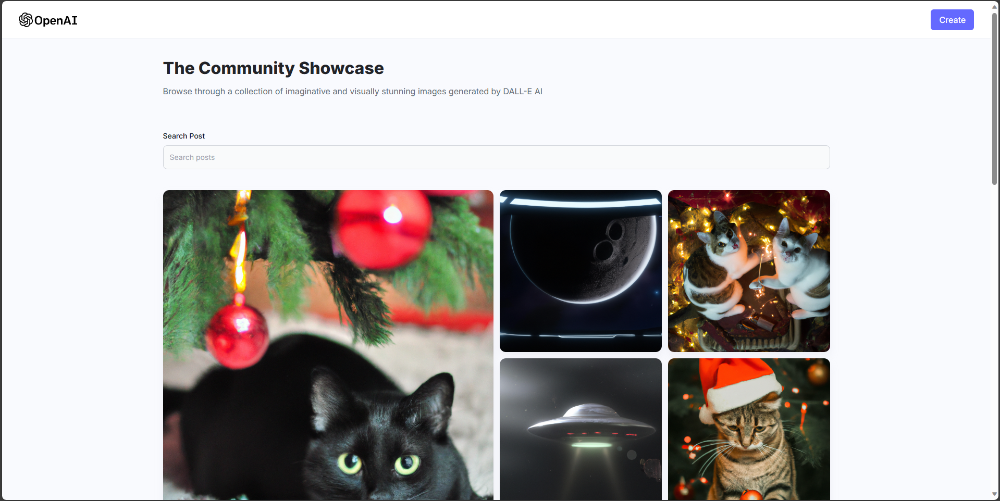
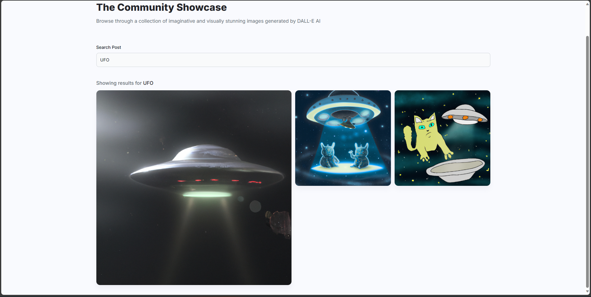
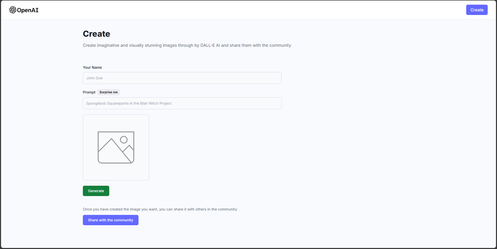
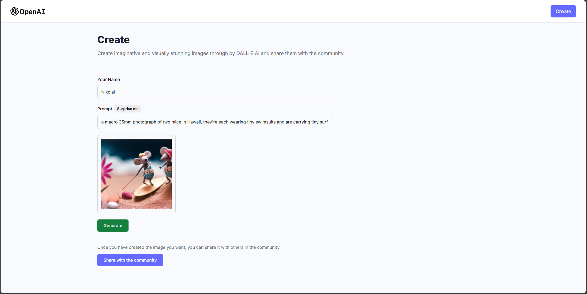

# Dalle_Clone
## Browse through a collection of imaginative and visually stunning images generated by DALL-E AI

This project is a kind of “clone” DALL-E by OpenAI, you can enter a request and DALL-E will generate an image for you, and if you want, you can publish it to the general feed.

## Features

- View images of users, as well as prompts used to generate them
- You can find any image using search
- Creating an image based on your prompts
- No ideas? Click on the "Surprise Me" button
- Post the generated image
- You can download any image from the feed

## Main Page

## Search

## Create Image

## Result

## Tech

Dalle_Clone uses a number of open source projects to work properly:

Frontend

- [React](https://react.dev/) - The library for web and native user interfaces
- [react-router-dom](https://github.com/remix-run/react-router#readme) - React Router is a lightweight, fully-featured routing library for the React JavaScript library.
- [tailwindcss](https://tailwindcss.com/) - Rapidly build modern websites without ever leaving your HTML.
- [file-saver](https://www.npmjs.com/package/file-saver) - FileSaver is the solution to saving files on the client-side, and is perfect for web apps that generates files on the client
  
Backend

- [Cloudinary](https://www.npmjs.com/package/cloudinary-react) - The [Cloudinary](https://cloudinary.com/) React SDK allows you to quickly and easily integrate your application with Cloudinary. Effortlessly optimize and transform your cloud's assets.
- [react-router-dom](https://github.com/remix-run/react-router#readme) - React Router is a lightweight, fully-featured routing library for the React JavaScript library.
- [express](https://www.npmjs.com/package/express) - The Express philosophy is to provide small, robust tooling for HTTP servers, making it a great solution for single page applications, websites, hybrids, or public HTTP APIs.
- [Mongoose](https://www.npmjs.com/package/mongoose) - Mongoose is a [MongoDB](https://www.mongodb.com/) object modeling tool designed to work in an asynchronous environment.
- [OpenAI Node API Library](https://www.npmjs.com/package/openai) - This library provides convenient access to the [OpenAI](https://openai.com/) REST API from TypeScript or JavaScript.
